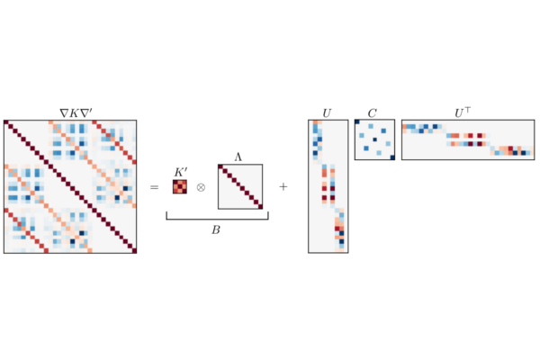
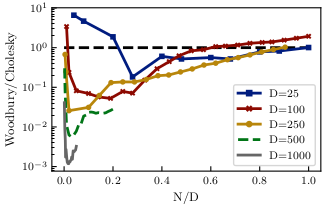

# GP-derivative 
Code accompanying the article: [High-Dimensional Gaussian Process Inference with Derivatives](https://arxiv.org/abs/2102.07542) [Accepted @ [ICML 2021](https://icml.cc/)]

## Summary
The kernel Gram matrix for gradient observations exhibits important structure. The figure below shows how the Gram matrix can be decomposed for usage with the matrix inversion lemma for high-dimensional inputs (D>N).


For high-dimensional input with few observations there can be a drastic speedup. 



## Citation 


```
@InProceedings{de-roos21gp-gradient,
  title =    {High-Dimensional Gaussian Process Inference with Derivatives},
  author =       {de Roos, Filip and Gessner, Alexandra and Hennig, Philipp},
  booktitle =    {Proceedings of the 38th International Conference on Machine Learning},
  year =     {2021},
  editor =   {Meila, Marina and Zhang, Tong},
  volume =   {139},
  series =   {Proceedings of Machine Learning Research},
  publisher =    {PMLR},
  pdf =      {http://proceedings.mlr.press/v139/de-roos21a/de-roos21a.pdf},
  url =      {http://proceedings.mlr.press/v139/de-roos21a.html},
```
